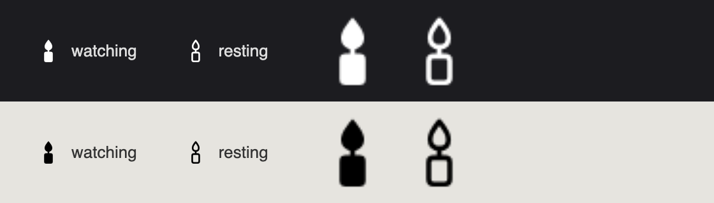

<p align="center">
  
</p>

<h1 align="center">Veglia</h1>

<p align="center">
  A candle in your menu bar that keeps the Mac awake while <b>Claude Code</b>, <b>Codex</b>, <b>Gemini CLI</b> or any other coding agent is working.<br>
  Lights itself when an agent starts, goes out when it stops. Nothing to click.
</p>

<p align="center">
  
</p>

---

## Why

You start a long agent session, walk away from the laptop, and keep talking to it from your phone. Five minutes later the display goes dark, one minute after that the MacBook falls asleep, and the session goes silent.

Veglia (Italian for *vigil*, a night kept awake by candlelight) watches for a running agent and asks macOS not to sleep for exactly as long as the session lives. The display still dims and locks as usual, so battery is spared. When the session ends, the candle goes out and the Mac may sleep again.

## What it does

- **Detects coding agents by itself.** Checks the process list every five seconds. Out of the box it knows Claude Code, Codex CLI, Gemini CLI, GitHub Copilot CLI, Cursor Agent, Aider, OpenCode, Amp, Goose, Qwen Code, Kimi CLI, Grok CLI, Continue, Kiro, Crush and Cline. Untick any of them under *Watch agents*.
- **Watches other apps too.** Tick DaVinci, Blender, Final Cut or anything else under *Watch apps*: while any ticked app is running, the Mac stays awake. Handy for renders and exports.
- **Optional: while a terminal is open.** Off by default, because many people keep a terminal open all day.
- **Shows who is holding the Mac.** The menu says *Claude Code, Blender are running — the Mac stays awake · 40 min*.
- **Optional: keep the display on.** Off by default; the screen goes dark, the Mac keeps working.
- **Optional: work with the lid closed.** Installs a tiny system helper (asks for an administrator password once) so a closed MacBook keeps running while a session is active, and sleeps normally once it ends. Read the warning below.
- **Stay awake always**, for when you just want a plain caffeine switch.
- **Launch at login.**
- **20 languages**, picked from the system or from the *Language* menu.

## Install

1. Download `Veglia.zip` from the [latest release](../../releases/latest) and unzip it.
2. Drag `Veglia.app` into your *Applications* folder and open it.
3. **First launch only:** macOS will say the developer cannot be verified, because Veglia is not signed with a paid Apple certificate. Right-click the app, choose *Open*, then *Open* again. Or go to *System Settings → Privacy & Security* and press *Open Anyway*. This happens once.

A candle appears in the menu bar. That is the whole interface.

Requires macOS 13 or newer.

## Working with the lid closed

Closing the lid puts a MacBook to sleep no matter what apps ask for. The only way around it is a system setting that only an administrator can change, so Veglia offers it as an explicit opt-in:

*Menu → Work with the lid closed → read the warning → Turn on → enter your password once.*

Veglia installs a small `launchd` daemon (`com.rosathings.veglia.lid`) that watches a flag file in `~/Library/Application Support/Veglia/`. Veglia writes the flag only while it is actively holding the Mac awake and removes it when the session ends or when Veglia quits. The daemon runs `pmset -a disablesleep 1` while the flag exists and `0` otherwise. So a closed Mac keeps working during a session and sleeps normally afterwards.

**Please read this part.** A closed laptop that keeps working gets warm. Do not put it in a bag or under a pillow. The battery drains as if the lid were open. Turn the mode off with one click when you do not need it.

To remove the helper by hand:

```sh
sudo launchctl bootout system/com.rosathings.veglia.lid
sudo rm /Library/LaunchDaemons/com.rosathings.veglia.lid.plist /Library/PrivilegedHelperTools/veglia-lid.sh
sudo pmset -a disablesleep 0
```

## How it works

Veglia is a small AppKit app in two Swift files. While watching, it holds an IOKit power assertion (`PreventUserIdleSystemSleep`, plus `PreventUserIdleDisplaySleep` if you asked to keep the display on), the same mechanism the system `caffeinate` tool uses. `pmset -g assertions` shows it as *Veglia*. Nothing runs in the background besides a five-second timer that calls `ps`.

An agent counts as running when a process whose name matches one of the known agents is alive. Node and Python based CLIs are recognised by the script name, so `node …/gemini.js` is Gemini CLI. To add an agent, append a line to `knownAgents` in `Sources/main.swift`.

## Build from source

No Xcode project, no dependencies. You need the Xcode command line tools and Google Chrome (the icons are rendered from SVG in `icons/` by headless Chrome).

```sh
./build.sh
```

The script renders the icons, compiles `Sources/*.swift` with `swiftc`, assembles `~/Applications/Veglia.app`, signs it ad hoc and launches it.

## Support

Veglia is free. If it saved your night, you can buy me a coffee: link coming soon.

Made in Rome by [Rosa Things](https://github.com/rroossaarroossaa). MIT license.
